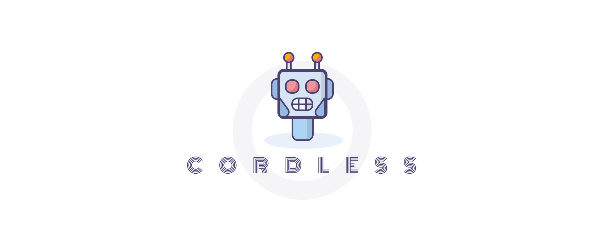

[](#)

<h3 align="center">Opinionated framework for creating Discord bots with minimal boilerplate</h3>
<p align="center">
  <a href="https://www.npmjs.com/package/cordless">
    
  </a>
  <a href="https://travis-ci.com/TomerRon/cordless">
    
  </a>
  <a href="https://github.com/semantic-release/semantic-release">
    
  </a>
</p>

**cordless** is a simple wrapper for [discord.js](https://github.com/discordjs/discord.js) that allows you to create extensive and extensible Discord bots.

```
yarn add cordless
npm i cordless
```

## Basic Usage

```ts
import { init, BotFunction } from 'cordless'

const ping: BotFunction = {
  condition: (msg) => msg.content === 'ping',
  callback: (msg) => msg.reply('pong'),
}

init({ functions: [ping] }).login(process.env.TOKEN)
```

## Contributing

Clone and install the dependencies:

```
git clone https://github.com/TomerRon/cordless.git
cd cordless
yarn
```

#### Local development

We recommend installing [yalc](https://github.com/wclr/yalc). Publish your changes locally with:

```
yalc publish
```

You can then test your changes in a local app using:

```
yalc add cordless
```

#### Unit tests

Run the unit tests:

```
yarn test
```

#### End-to-end tests

You must first create two bots and add them to a Discord server. One of the bots will run the cordless client, and the other bot will pretend to be a normal user.

You'll need the tokens for both of the bots, and the channel ID of a channel where the bots can send messages.

Copy the `.env` file and edit it:

```
cp .example.env .env
```

```
# .env
E2E_CLIENT_TOKEN=some.discord.token
E2E_USER_TOKEN=some.discord.token
E2E_CHANNEL_ID=12345678
```

Run the e2e tests:

```
yarn e2e
```

## Contributors

Huge shoutout to [fivenp](https://fivenp.com/) ([@fivenp](https://github.com/fivenp)) for the amazing visual assets. Go check out his work!

## License

This project is licensed under the ISC License - see the [LICENSE](LICENSE) file for details.
